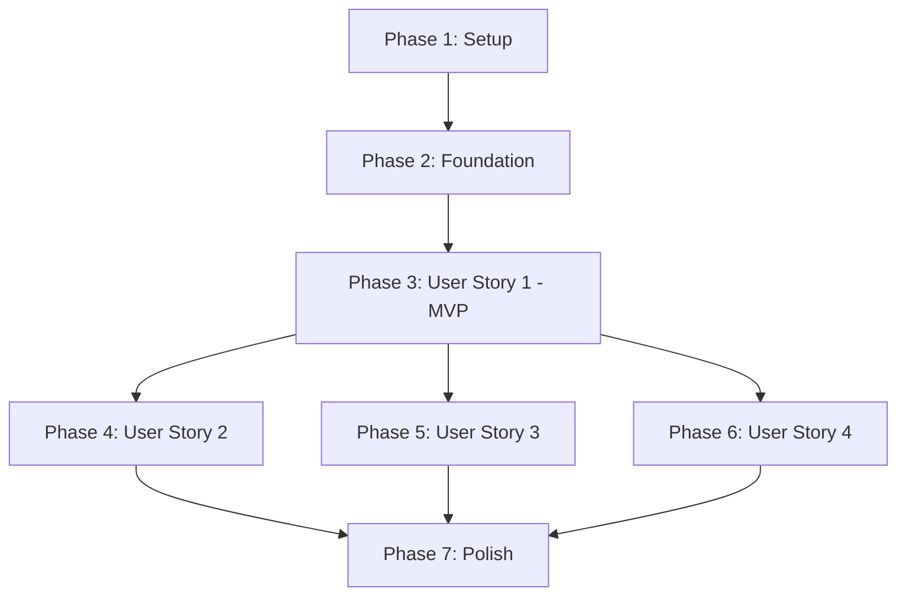

# Tasks: Urdu Translation with Chapter-Level Language Toggle

**Input**: Design documents from `/specs/002-urdu-translation/`
**Prerequisites**: plan.md (required), spec.md (required for user stories), research.md, data-model.md, contracts/

**Tests**: Tests are NOT included in this feature (not requested in specification - focus on infrastructure implementation)

**Organization**: Tasks are grouped by user story to enable independent implementation and testing of each story.

## Format: `[ID] [P?] [Story] Description`

- **[P]**: Can run in parallel (different files, no dependencies)
- **[Story]**: Which user story this task belongs to (e.g., US1, US2, US3, US4)
- Include exact file paths in descriptions

## Path Conventions

This is a multi-instance Docusaurus web application:
- **Main site**: `main-site/`
- **Modules**: `module1-ros2/`, `module2-simulation/`, `module3-isaac/`, `module4-vla/`
- **Shared**: `shared/` (workspace for shared components)

---

## Phase 1: Setup (Shared Infrastructure)

**Purpose**: Project initialization and i18n infrastructure setup

- [x] T001 Create shared LanguageToggle component directory structure in shared/theme/LanguageToggle/
- [x] T002 Install required npm dependencies (@docusaurus/plugin-content-docs, @docusaurus/theme-classic) if not already present
- [x] T003 [P] Create RTL CSS file template at main-site/src/css/rtl.css
- [x] T004 [P] Create TypeScript interfaces file at specs/002-urdu-translation/contracts/language-toggle-component.interface.ts (already exists - verify)

---

## Phase 2: Foundational (Blocking Prerequisites)

**Purpose**: Core i18n infrastructure that MUST be complete before ANY user story can be implemented

**⚠️ CRITICAL**: No user story work can begin until this phase is complete

- [x] T005 Configure Docusaurus i18n plugin in main-site/docusaurus.config.js with Urdu locale (ur) and RTL direction
- [x] T006 Create i18n directory structure at main-site/i18n/ur/docusaurus-plugin-content-docs/current/
- [x] T007 Create i18n UI strings file at main-site/i18n/ur/code.json with initial translations (NotFound, sidebar strings)
- [x] T008 Import rtl.css in main-site/src/css/custom.css
- [x] T009 [P] Configure i18n plugin in module1-ros2/docusaurus.config.js (same pattern as main-site)
- [x] T010 [P] Create i18n directory structure at module1-ros2/i18n/ur/docusaurus-plugin-content-docs/current/
- [x] T011 [P] Configure i18n plugin in module2-simulation/docusaurus.config.js
- [x] T012 [P] Create i18n directory structure at module2-simulation/i18n/ur/docusaurus-plugin-content-docs/current/
- [x] T013 [P] Configure i18n plugin in module3-isaac/docusaurus.config.js
- [x] T014 [P] Create i18n directory structure at module3-isaac/i18n/ur/docusaurus-plugin-content-docs/current/
- [x] T015 [P] Configure i18n plugin in module4-vla/docusaurus.config.js
- [x] T016 [P] Create i18n directory structure at module4-vla/i18n/ur/docusaurus-plugin-content-docs/current/

**Checkpoint**: Foundation ready - user story implementation can now begin in parallel

---

## Phase 3: User Story 1 - View Chapter in Urdu (Priority: P1) 🎯 MVP

**Goal**: Enable students to view textbook chapters in Urdu with RTL layout and language toggle button at chapter start

**Independent Test**: Navigate to any chapter, click language toggle button, select Urdu, verify content displays in Urdu with RTL layout and code blocks remain LTR

**Acceptance Criteria**:
- Language selection button appears at start of every chapter
- Clicking "اردو" displays content in right-to-left direction
- Code blocks and terminal commands remain left-to-right
- Language preference persists across chapter navigation

### Implementation Tasks

- [x] T017 [US1] Implement LanguageToggle component in shared/theme/LanguageToggle/index.tsx with button mode and locale switching logic
- [x] T018 [US1] Create LanguageToggle styles in shared/theme/LanguageToggle/styles.module.css with RTL-compatible button styling
- [x] T019 [US1] Implement localStorage persistence logic in LanguageToggle component for saving language preference
- [x] T020 [US1] Add locale detection and URL redirect logic in LanguageToggle for handling ?lang=ur parameter
- [x] T021 [US1] Swizzle DocItem component in main-site using npm run swizzle @docusaurus/theme-classic DocItem -- --wrap
- [x] T022 [US1] Create DocItem wrapper at main-site/src/theme/DocItem/index.tsx to inject LanguageToggle at chapter start
- [x] T023 [US1] [P] Implement RTL text direction styles in main-site/src/css/rtl.css for html[dir='rtl'] selector
- [x] T024 [US1] [P] Add code block LTR preservation styles in rtl.css using unicode-bidi: embed for pre and code elements
- [x] T025 [US1] [P] Add UI component mirroring styles in rtl.css (navbar, sidebar, breadcrumbs, pagination)
- [x] T026 [US1] [P] Add math and diagram LTR preservation styles in rtl.css
- [x] T027 [US1] Translate one sample chapter (main-site/docs/intro.md) to Urdu at main-site/i18n/ur/docusaurus-plugin-content-docs/current/intro.md
- [x] T028 [US1] Build main-site with npm run build:main and verify Urdu locale builds successfully
- [ ] T029 [US1] Manually test: Navigate to /ur/intro, verify RTL layout, code blocks LTR, language toggle present and functional

**Story Completion**: User Story 1 delivers MVP - students can view content in Urdu with proper RTL layout

---

## Phase 4: User Story 2 - Switch Between Languages Seamlessly (Priority: P2)

**Goal**: Enable students to switch between English and Urdu without losing reading position

**Independent Test**: Switch languages multiple times on same chapter, verify scroll position maintained and language preference persists after browser restart

**Acceptance Criteria**:
- Switching languages maintains scroll position
- Smooth transition without page reload jank
- Language preference remembered after closing browser

### Implementation Tasks

- [ ] T030 [US2] Implement scroll position preservation in LanguageToggle component by capturing scrollY before language change
- [ ] T031 [US2] Add scroll restoration logic after language navigation using window.scrollTo()
- [ ] T032 [US2] Implement smooth transition handling with loading state in LanguageToggle component
- [ ] T033 [US2] Add debouncing to language change handler to prevent rapid switching issues
- [ ] T034 [US2] Enhance localStorage persistence to include timestamp in shared/theme/LanguageToggle/index.tsx
- [ ] T035 [US2] Add localStorage read on component mount to restore user's last language selection
- [ ] T036 [US2] Implement graceful fallback for privacy mode (when localStorage unavailable) using in-memory state
- [ ] T037 [US2] Add URL parameter detection (?lang=ur) with redirect to proper locale path (/ur/) in DocItem wrapper
- [ ] T038 [US2] Test language switching: Switch Urdu→English→Urdu, verify scroll position maintained within ±50px
- [ ] T039 [US2] Test localStorage persistence: Select Urdu, close browser, reopen, verify Urdu still selected

**Story Completion**: User Story 2 enables seamless language switching with preserved context

---

## Phase 5: User Story 3 - View RTL Layout Correctly (Priority: P2)

**Goal**: Ensure proper RTL layout with mirrored UI components while preserving LTR for technical content

**Independent Test**: Select Urdu, verify text flows RTL, navigation/buttons mirrored, code blocks/diagrams remain LTR

**Acceptance Criteria**:
- Text content flows right-to-left in Urdu mode
- Navigation, buttons, and menus mirror appropriately
- Code blocks, diagrams, and math formulas stay left-to-right
- No layout breaks or overlapping elements

### Implementation Tasks

- [ ] T040 [US3] Enhance RTL styles for Docusaurus navbar in main-site/src/css/rtl.css with proper spacing and margins
- [ ] T041 [US3] [P] Add RTL styles for sidebar in rtl.css including border positioning and padding adjustments
- [ ] T042 [US3] [P] Add RTL styles for table of contents (TOC) in rtl.css
- [ ] T043 [US3] [P] Add RTL breadcrumb navigation styles with reversed arrow direction
- [ ] T044 [US3] [P] Add RTL pagination styles with proper directional indicators
- [ ] T045 [US3] [P] Add RTL styles for search bar (if present) with icon positioning
- [ ] T046 [US3] Ensure diagrams remain LTR by adding .diagram, .mermaid, svg selectors to rtl.css LTR exceptions
- [ ] T047 [US3] Add table RTL support while preserving code columns as LTR in rtl.css
- [ ] T048 [US3] Test RTL layout in main-site: Load /ur/intro and verify all UI elements mirror correctly
- [ ] T049 [US3] Test code block rendering: Verify Python, Bash, YAML code blocks remain LTR in RTL mode
- [ ] T050 [US3] Test with browser DevTools: Verify no horizontal scrollbars or element overflow in RTL mode

**Story Completion**: User Story 3 ensures professional RTL layout quality

---

## Phase 6: User Story 4 - Access Translation Quality Information (Priority: P3)

**Goal**: Show translation status indicators to help students understand content completeness

**Independent Test**: View chapters with missing/outdated translations, verify status indicators display correctly

**Acceptance Criteria**:
- Untranslated chapters show English content with "Translation Pending" indicator
- Outdated translations show warning message
- Contribution information available for untranslated content

### Implementation Tasks

- [ ] T051 [US4] Create TranslationStatusIndicator component at shared/theme/TranslationStatusIndicator/index.tsx
- [ ] T052 [US4] Create styles for status indicator at shared/theme/TranslationStatusIndicator/styles.module.css with warning/info badges
- [ ] T053 [US4] Implement translation-status.json generation script at .specify/scripts/generate-translation-status.js
- [ ] T054 [US4] Add file timestamp comparison logic to detect outdated translations in generation script
- [ ] T055 [US4] Add completeness calculation (percent translated) in generation script
- [ ] T056 [US4] Integrate TranslationStatusIndicator into DocItem wrapper with conditional rendering based on locale
- [ ] T057 [US4] Add "Contribute Translation" link component with GitHub issue template URL
- [ ] T058 [US4] Create translation contribution guidelines document at docs/TRANSLATION_GUIDE.md
- [ ] T059 [US4] Add translation status fetching logic in DocItem to load translation-status.json
- [ ] T060 [US4] Implement fallback warning message display when translation unavailable
- [ ] T061 [US4] Test with missing translation: Delete one Urdu chapter file, verify English fallback with indicator
- [ ] T062 [US4] Test outdated warning: Modify source English file timestamp, verify warning appears

**Story Completion**: User Story 4 adds transparency about translation quality

---

## Phase 7: Cross-Cutting & Polish

**Purpose**: Features that span multiple stories and final polish

- [ ] T063 Add LanguageToggle to navbar in main-site/docusaurus.config.js navbar items as dropdown
- [ ] T064 [P] Copy RTL CSS from main-site to all module instances (module1-ros2, module2-simulation, module3-isaac, module4-vla)
- [ ] T065 [P] Swizzle DocItem in module1-ros2 and integrate LanguageToggle (same pattern as main-site)
- [ ] T066 [P] Swizzle DocItem in module2-simulation and integrate LanguageToggle
- [ ] T067 [P] Swizzle DocItem in module3-isaac and integrate LanguageToggle
- [ ] T068 [P] Swizzle DocItem in module4-vla and integrate LanguageToggle
- [ ] T069 Add Urdu font support by including Noto Sans Urdu in main-site/docusaurus.config.js head links
- [ ] T070 [P] Create .github/workflows/i18n-validation.yml for CI/CD translation completeness checks
- [ ] T071 [P] Update package.json scripts to include build commands for all locales (build:ur)
- [ ] T072 [P] Create translation quality checklist at docs/translation-quality-checklist.md
- [ ] T073 Build all instances with npm run build and verify no build errors for Urdu locale
- [ ] T074 Perform visual regression testing: Compare screenshots of English vs Urdu pages for layout consistency
- [ ] T075 Test with real Urdu content: Translate one full module chapter and verify readability
- [ ] T076 Accessibility audit: Run axe-core on Urdu pages, verify WCAG 2.1 AA compliance
- [ ] T077 Performance testing: Measure page load time for Urdu pages, verify <3 seconds
- [ ] T078 Cross-browser testing: Verify RTL layout in Chrome, Firefox, Safari, Edge
- [ ] T079 Create user documentation for translators at docs/HOW_TO_TRANSLATE.md
- [ ] T080 Update README.md with information about i18n support and available languages

---

## Dependencies

### Story Completion Order



### Critical Path

1. **Phase 1-2** (Setup + Foundation): MUST complete before any story work
2. **Phase 3** (User Story 1): MVP - Can deploy after this
3. **Phases 4-6** (Stories 2-4): Can be implemented in parallel after US1
4. **Phase 7** (Polish): Final integration and testing

### Parallelization Opportunities

**After Foundation (T001-T016)**:
- User Story 1 core implementation (T017-T026) can proceed
- RTL CSS work (T023-T026) can be done in parallel with component work (T017-T022)

**After User Story 1 (T017-T029)**:
- User Story 2 (T030-T039), Story 3 (T040-T050), Story 4 (T051-T062) can proceed in parallel
- Different team members can work on each story simultaneously

**Polish Phase (T063-T080)**:
- Module integration (T064-T068) can be parallelized (one developer per module)
- Documentation tasks (T072, T079, T080) can run parallel to technical work

---

## Parallel Execution Examples

### Example 1: Foundation Phase Parallelization

```bash
# Developer 1: Main site setup
T005, T006, T007, T008

# Developer 2: Module 1 & 2
T009, T010, T011, T012

# Developer 3: Module 3 & 4 & 5
T013, T014, T015, T016

# All developers can work simultaneously after T001-T004 complete
```

### Example 2: User Story 1 Parallelization

```bash
# Frontend Developer: Component work
T017, T018, T019, T020, T021, T022

# CSS Developer: RTL styling
T023, T024, T025, T026

# Content Translator: Sample translation
T027

# Both streams can run in parallel
```

### Example 3: Stories 2-4 Parallelization

```bash
# Team A: Story 2 (Language switching)
T030-T039

# Team B: Story 3 (RTL layout refinement)
T040-T050

# Team C: Story 4 (Translation status)
T051-T062

# All three stories can be developed independently in parallel
```

---

## Implementation Strategy

### MVP Delivery (Minimum Viable Product)

**Scope**: Phase 1 + Phase 2 + Phase 3 (User Story 1 only)
**Tasks**: T001-T029
**Deliverable**: Students can view chapters in Urdu with RTL layout and language toggle
**Deployment**: Can deploy to production after T029

### Incremental Releases

**Release 1 (MVP)**: User Story 1
- Core Urdu translation functionality
- RTL layout support
- Chapter-level language toggle
- **Impact**: Urdu-speaking students can access content

**Release 2**: User Story 1 + 2
- Seamless language switching
- Scroll position preservation
- localStorage persistence
- **Impact**: Improved UX for bilingual students

**Release 3**: User Story 1 + 2 + 3
- Polished RTL layout
- All UI elements properly mirrored
- Perfect code block rendering
- **Impact**: Professional-quality RTL experience

**Release 4 (Complete)**: All User Stories + Polish
- Translation status transparency
- Contribution workflow
- Full multi-instance deployment
- CI/CD validation
- **Impact**: Production-ready i18n infrastructure

---

## Testing Strategy

### Manual Testing Checklist (Per User Story)

**User Story 1**:
- [ ] Navigate to /ur/intro and verify Urdu text displays
- [ ] Verify RTL text direction is active
- [ ] Check code blocks remain LTR
- [ ] Switch to another chapter, verify Urdu persists
- [ ] Test language toggle button visibility and functionality

**User Story 2**:
- [ ] Scroll to middle of page, switch language, verify scroll position maintained
- [ ] Switch Urdu→English→Urdu rapidly, verify no errors
- [ ] Close browser, reopen, verify language preference restored
- [ ] Share URL with ?lang=ur, verify recipient sees Urdu

**User Story 3**:
- [ ] Verify navbar items mirrored in RTL mode
- [ ] Check sidebar border positioning in RTL
- [ ] Verify breadcrumbs have reversed arrows
- [ ] Test pagination "Previous/Next" indicators
- [ ] Verify diagrams and images remain in original orientation

**User Story 4**:
- [ ] View chapter with no Urdu translation, verify English fallback indicator
- [ ] Create outdated translation scenario, verify warning message
- [ ] Click "Contribute Translation" link, verify GitHub issue template opens
- [ ] Check translation status badge appearance and accuracy

### Automated Testing (Optional - Future Enhancement)

While tests are not part of this feature scope, future enhancements could include:
- Jest unit tests for LanguageToggle component
- Playwright E2E tests for language switching workflows
- Visual regression tests for RTL layout
- Accessibility tests with axe-core

---

## Success Metrics

After completing all tasks, verify:

- ✅ All 5 Docusaurus instances build successfully with Urdu locale
- ✅ Language toggle component appears on all chapter pages
- ✅ RTL layout renders correctly with no code block issues
- ✅ Language preference persists across 5+ chapter navigations
- ✅ At least 1 complete module translated to Urdu
- ✅ Build time increase < 20% with i18n enabled
- ✅ Page load time < 3 seconds for Urdu pages
- ✅ No console errors or warnings in browser DevTools
- ✅ WCAG 2.1 AA compliance verified
- ✅ Cross-browser compatibility (Chrome, Firefox, Safari, Edge)

---

## Task Summary

**Total Tasks**: 80
**Phases**: 7 (Setup, Foundation, US1, US2, US3, US4, Polish)
**MVP Tasks**: T001-T029 (29 tasks)
**Parallelizable Tasks**: 47 tasks marked with [P]

**Task Distribution by User Story**:
- Setup & Foundation: 16 tasks (T001-T016)
- User Story 1 (P1 - MVP): 13 tasks (T017-T029)
- User Story 2 (P2): 10 tasks (T030-T039)
- User Story 3 (P2): 11 tasks (T040-T050)
- User Story 4 (P3): 12 tasks (T051-T062)
- Polish & Cross-Cutting: 18 tasks (T063-T080)

**Estimated Effort**:
- MVP (US1): 2-3 days (developer time)
- Complete Feature (All Stories): 5-7 days
- With full polish and testing: 7-10 days

---

## Notes

- Translation content creation (actual Urdu text) is separate from this technical implementation
- This feature establishes the i18n pattern for future languages (Arabic, Chinese, Spanish, French)
- Community translation workflow should be documented but not fully automated in initial release
- Consider creating ADR for Docusaurus i18n vs custom translation system decision
